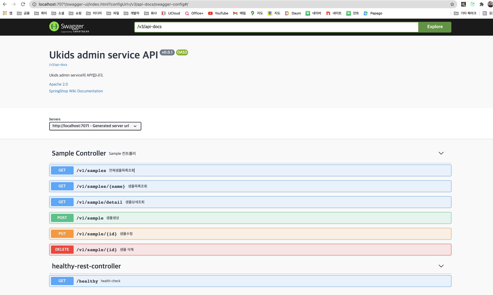
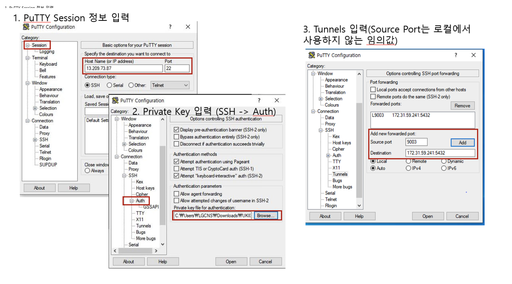

# Getting Started

## 로컬 환경 구성

로컬 ukids-be-admin Spring boot 환경 구성

## General Project Structure

```bash
├─ bin/                                         # Directory for builds
├─ doc/                                         # Directory for documents
├─ gradle/                                      # Directory for gradle
├─ libs                                         # Directory for external jars
├─┬ src/main/
│ ├─┬ java/com/lguplus/ukids/admin/
│ │ ├─ annotation/                              # Directory for custom annotation(no logging)
│ │ ├─ aspect/                                  # Directory for Spring Boot Aspect(encrypt, log)
│ │ ├─ config/                                  # Directory for Spring Boot Configure Beans
│ │ ├─ constants/                               # Directory for Constants variables
│ │ ├─ controller/                              # Directory for restcontrollers and controller for jsp
│ │ ├─ dto/                                     # Directory for data transfer object model
│ │ ├─ exception/                               # Directory for exception based AOP
│ │ ├─ healthy/                                 # Directory for Healthy Controller
│ │ ├─ interceptor/                             # Directory for interceptors(session)
│ │ ├─ listener/                                # Directory for kafaka listener(consumer)
│ │ ├─ repository/                              # Directory for repositories
│ │ ├─ service/                                 # Directory for services
│ │ ├─ utility/                                 # Directory for java utilities
│ │ └─ UKidsAdminApplication                    # Spring Boot Application class
│ ├─┬ resources/                                # Directory for static resources
│ │ ├─ sql/                                     # Directory for sql files using mybatis
│ │ └─ application.yml                          # Spring boot configure file
│ └── webapp/WEB-INF/jsp                        # Directory for jsp
├─ build.gradle                                 # gradle build file
├─ Docker-entrypoint.sh                         # docker build sh in CICD
└─ Dockerfile                                   # docker build sh in CICD
```

# VS Code

IDE 설치
개발툴은 개별 취향에 맞게 선택
여기서는 vscode 기준

- VS Code(https://code.visualstudio.com/)
- eclipse
- intelliJ 등

# VS Code Extensions

개발을 위한 필수 Extention

- Spring Initializr Java Support - 스프링 프로젝트 만들때 템플릿
- Spring Boot Extension Pack - 스프링 개발에 필요한 익스텐션
- Spring Boot Tools - boot configuration
- Java Dependency Viewer - 의존성, 참조
- Debugger for Java - 자바 디버깅
- Java Extension Pack - 인기있는 자바 익스텐션 모음
- Language Support for Java by Red Hat - 코드 네비게이션, 리팩토링 등 생산성 향상
- Java Test Runner - JUnit등 테스트 실행
- Gradle Language Support - Gradle
- Gradle Task - Gradle Build
- Lombok Annotations Support for VS Code - 롬복

# CI

소스관리

- Git Client 설치
- Git Repository Url: TBD(github)

# Branch 전략(TBD)

- feature/develop/stage/master 가 기본 Branch
- feature는 jira issue할당 받으면 develop에서 분기하여 생성
- naming rule -> (feature|bugfix|hotfix)/nickname-jira번호-description
- 예시) feature/jin-100-게시글-등록

# Swagger 3(open api 3)

API 관리

- http://localhost:7070/swagger-ui.html



# DB 접속정보

아래 파일들을 생성하여 위치시킨다.

- /etc/secret/ADMIN_ENDPOINT : db endpoint ex) localhost:3306
- /etc/secret/ADMIN_USERNAME : db user name ex) ukids_dev
- /etc/secret/ADMIN_PASSWORD : db user password ex) !ukids_dev2021
- /etc/secret/ADMIN_DATABASE : db database name ex) admindb
- /etc/secret/ADMIN_SCHEMA : db schema ex) admin_schema
  MEMBER 등 다른 domain에 대해서도 위 5개 파일을 똑같이 생성
- /etc/secret/REDIS_ENDPOINT : redis endpoint 포트없음 ex) localhost TBD
- windows경우 C:\etc\secret\ 하위에 위치

# bastion을 이용한 터널링

aws의 자원에 접근하기 위하여 bastion으로 터널링하여 접근함

윈도우즈에서는 putty를 이용



mac이나 linux 기반에서는 ssh 이용
$ ssh -i ~/workspace/secret/UKIDS-SHD-BASTION-RDS-KEYPAIR.pem -N -L 5432:172.31.59.210:5432 -N -L 5433:172.31.59.196:5433 -N -L 9094:b-1.cls-ukids-dev-msk.6iseea.c2.kafka.ap-northeast-2.amazonaws.com:9094 -N -L 6379:ukids-dev-redis.4bvshh.clustercfg.apn2.cache.amazonaws.com:6379 ec2-user@13.209.73.87

# openjdk 11 설치

Open JDK 설치

- jdk다운로드 및 로컬 설치 : https://jdk.java.net/archive
- 그외 JAVA_HOME과 PATH 추가는 환경변수를 활용함(GIT Bash 또는 WSL, CMD는 환경변수에 따라 동작함)

# 기동

1. spring boot 기동

   - spring boot dashboard 사용
   - 혹은 ./gradlew bootRun

2. health check
   - GET, http://localhost:7070/healthy
   - 응답, 200 OK, {"status": "UP"}

# aws credential 파일 생성

1. 경로

- C:\사용자\Administrator\\.aws\credentials

2. 내용

```
[default]
aws_access_key_id = 키id값
aws_secret_access_key = 키값
```
